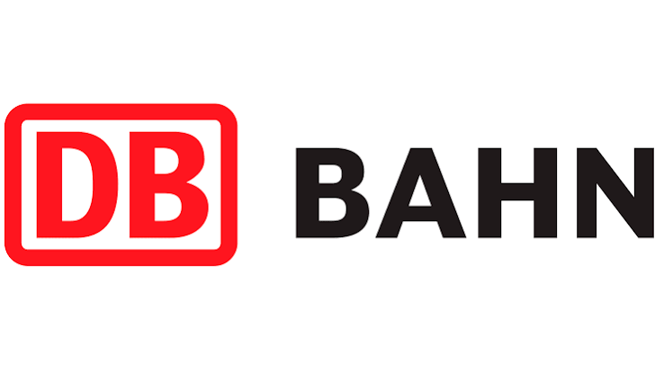

# DB Playwright Framework

Preliminary end-to-end UI automation framework for Deutsche Bahn journey search flows using Python, `pytest`, and Playwright.

## Overview

This repository contains a small page-object-based test framework targeting the DB website. The current implementation focuses on core trip search scenarios from the home page, including:

- Basic one-way trip search
- First-class trip search
- Search for a trip on the next day
- Round-trip search

The project is still in an early state. Some files are placeholders, and the test suite currently emphasizes flow coverage over deep result assertions.

## Tech Stack

- Python
- `pytest`
- Playwright for Python
- Page Object Model (POM)

## Current Project Structure

```text
.
├── images/
│   └── DB_logo.png
├── pages/
│   ├── base_page.py
│   ├── home_page.py
│   └── result_page.py
├── tests/
│   ├── conftest.py
│   ├── test_localization.py
│   ├── test_search.py
│   └── test_search_trip.py
├── pytest.ini
├── README.md
└── requirements.txt
```

## Implemented Pages

### `BasePage`

Provides shared browser actions such as:

- Opening a URL
- Handling the cookie banner

### `HomePage`

Encapsulates the main DB trip search form, including:

- Origin and destination selection
- First-class selection
- Tomorrow date selection
- Round-trip selection
- Search submission

## Test Coverage

The current `test_search_trip.py` file covers these happy-path scenarios:

- Search from Berlin to Hamburg
- Search first class
- Search for tomorrow
- Search a round trip

## Getting Started

### 1. Create and activate a virtual environment

```bash
python -m venv .venv
source .venv/bin/activate
```

### 2. Install dependencies

`requirements.txt` is currently not populated, so install the core tooling directly for now:

```bash
pip install pytest playwright
python -m playwright install
```

### 3. Run the tests

```bash
pytest
```

To run a specific file:

```bash
pytest tests/test_search_trip.py
```

## Design Notes

- The framework follows the Page Object Model to keep test logic separated from UI selectors and interactions.
- The current implementation uses live UI interactions against `https://www.bahn.de/`.
- Some selectors depend on the current site language and DOM structure, so maintenance will be needed if the site changes.

## Next Improvements

- Populate `requirements.txt`
- Add stable assertions on the results page
- Expand `result_page.py`
- Add configuration for environments and base URLs
- Improve date handling and selector resilience
- Add reporting and CI integration

## Status

This is a preliminary README intended to document the current state of the repository and provide a clean base for future expansion.
